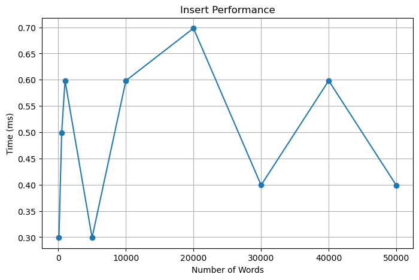
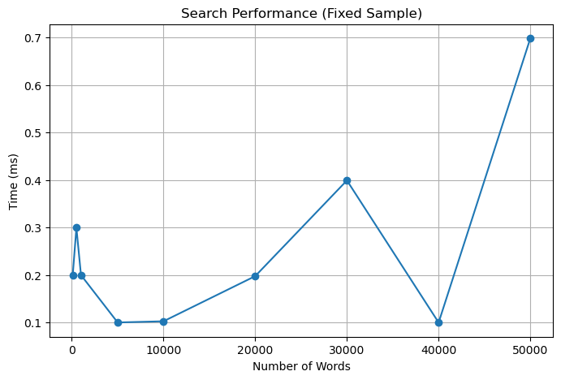
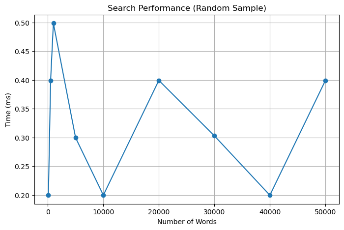
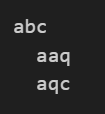
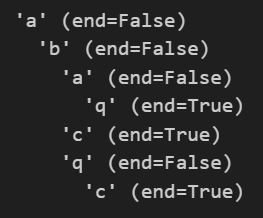

# Ternary Search Tree Implementation

This project implements a Ternary Search Tree (TST) in Python for efficient string storage and prefix searching, and compares its performance against traditional data structures like Binary Search Tree (Btree) and Python's built-in set.

## Key Features

- **Complete TST Implementation**: Object-oriented design with full functionality
- **Testing**: Unit tests, and performance tests  
- **HPC Benchmarking**: Performance analysis on high-performance computing infrastructure
- **Visualization (demo jupyter file)**: Interactive notebooks and performance plots
- **Comparison Studies**: Benchmarks against Python's built-in set structures and Btree

## Project Structure

```
ternary-search-tree/
│
├── benchmark/              
│   ├── benchmark.py                      # Benchmark experiments and performance comparison
│   ├── benchmark_output_58227207.log     # Benchmark results in HPC
│   └── plot/
│
├── data/                   # Input word lists
│   ├── corncob_lowercase.txt     # 58,110 words list, used for benchmark
│   ├── insert_words.txt          # Used for unit test insertions
│   └── not_insert_words.txt      # Used for negative test cases
│
├── tstree/                 # TSTree implementation
│   └── tstree.py
│
├── btree/                  # Btree implementation (used for comparison with TSTree)
│   └── btree.py
│
├── tests/                  # Unit tests
│   └── tests_tstree.py
│
├── demo_tstree.ipynb           # Demo output jupyter file
├── slurm_job.slurm             # SLURM script to run benchmarks on HPC
├── README.md                   # Overview information about project
└── requirements.txt            # Required library list
```

## Quick Start

### Prerequisites

- Python 3.6 (to run in HPC) or higher
- Git
- Access to HPC infrastructure (for performance benchmarking)

### Installation

1. **Clone the repository**:
   ```bash
   git clone https://github.com/thientruc1691997/search_treee
   ```

2. **Install dependencies**:
   ```bash 
   pip install -r requirements.txt  
   ```

3. **Run Benchmarks**:
   ```bash
   python3 benchmark/benchmark.py
   ```
4. **Run Test**:
   ```bash
   python3 tests/tests_tstree.py
   ```
5. **Run on HPC**
   ```bash
   sbatch slurm_job.slurm
   ```

## Performance Characteristics

Although TSTree is slower than BTree and Python's set for full-string insert and search operations, it offers a key advantage: efficient prefix-based lookup.

Unlike set or BTree, which lack native support for prefix queries, TSTree enables fast autocomplete and partial string matching with minimal overhead. This makes it especially valuable for applications like autocomplete, dictionary suggestions, or incremental search.

In short, TSTree trades some performance for greater query flexibility.

### Evaluation Strategy
To thoroughly assess the functionality and performance of the Ternary Search Tree, three types of tests were conducted on a high-performance computing (HPC) environment:

- Unit Tests

- Benchmark TSTree on large dataset (with fixed/random sample)

- Benchmark Comparison with BTree and Python set

1. **Unit Tests**

Unit testing was carried out using the TSTreeTester class on an initially empty tree, with the following objectives:

- Confirm that the number of inserted words matches the number of entries in insert_words.txt.

- Verify that all inserted words can be successfully retrieved.

- Ensure that no words from not_insert_words.txt are incorrectly found.

- Validate that all stored strings are returned in the correct order.

All four test cases passed successfully, confirming the correctness of the core TSTree functionality.

2. **Benchmark TSTree on large dataset**

We benchmarked TSTree using the corncob_lowercase.txt file (~58,000 sorted words) under varying dataset sizes and sampling methods.

- **Insertion Performance**: TSTree exhibits robust insert speeds, maintaining ≤0.70 ms per word even at 50,000-word scale.

- **Search Performance (Fixed Sample)**: TSTree provides consistent and fast search times (typically ≤0.40 ms) for a fixed set of queries.

- **Search Performance (Random Sample)**: TSTree also handles random-access search efficiently, with average lookup times between 0.20–0.50 ms.


These results confirm that TSTree is well-suited for real-time, large-scale applications that rely on flexible search capabilities.
3. **Benchmark Comparison with BTree and Python set**

To evaluate TSTree in context, we compared its performance and structure against two other data structures: BTree and Python’s built-in set.

**Procedure**
- Loaded and validated the word list from corncob_lowercase.txt.

- Measured insert/search times for increasing dataset sizes (100 to 50,000 words).

- Performed qualitative comparisons based on structure and capabilities.

**Structural Differences**
- BTree organizes data via node-based key ordering:


- TSTree uses character-wise ternary branching:


These structural differences lead to varied performance and feature support.

**Performance Summary**
```
| Feature / Operation       | Python `set`              | `BTree`                      | `TSTree`                         |
| ------------------------- | ------------------------- | ---------------------------- | -------------------------------- |
| **Structure**             | Hash-based, unordered     | Balanced tree (binary order) | Ternary character-wise branching |
| **Insert (1000 words)**   | 18.95 ms (100 words case) | 6.2 ms                       | 18.1 ms                          |
| **Search (1000 words)**   | \~0.00 ms                 | 0.7 ms                       | 1.1 ms                           |
| **All Strings (Ordered)** | No (unordered)             | Yes                            | Yes                                |
| **Prefix Search**         | No                         | No                            | Yes (0.2 ms for prefix = "ca")     |
```
### Results Summary
**Functional Correctness**
- All unit tests passed, verifying insertion, exact-match, negative, and full retrieval operations.

**Performance Summary**
- TSTree is slower than BTree and set in raw operations but uniquely supports prefix search, making it ideal for applications like autocomplete.

- BTree offers good speed and ordered retrieval but lacks prefix functionality.

- Python set is fastest for lookups but is unordered and cannot support prefix queries.

### Conclusion
If the application prioritizes exact-match performance or unordered bulk storage, set or BTree may be more efficient.

However, if prefix matching (e.g., autocomplete, search suggestions) is critical, then TSTree is a powerful and scalable choice. It balances reasonable speed with flexible query capabilities and maintains excellent performance even on large-scale datasets.

## References

1. Bentley, J., & Sedgewick, R. (1997). *Fast algorithms for sorting and searching strings*. SODA '97.
2. Sedgewick, R., & Wayne, K. (2011). *Algorithms* (4th ed.). Addison-Wesley.
3. [Wikipedia: Ternary Search Tree](https://en.wikipedia.org/wiki/Ternary_search_tree)
4. [VSC Documentation](https://docs.vscentrum.be/) for HPC usage guidelines

